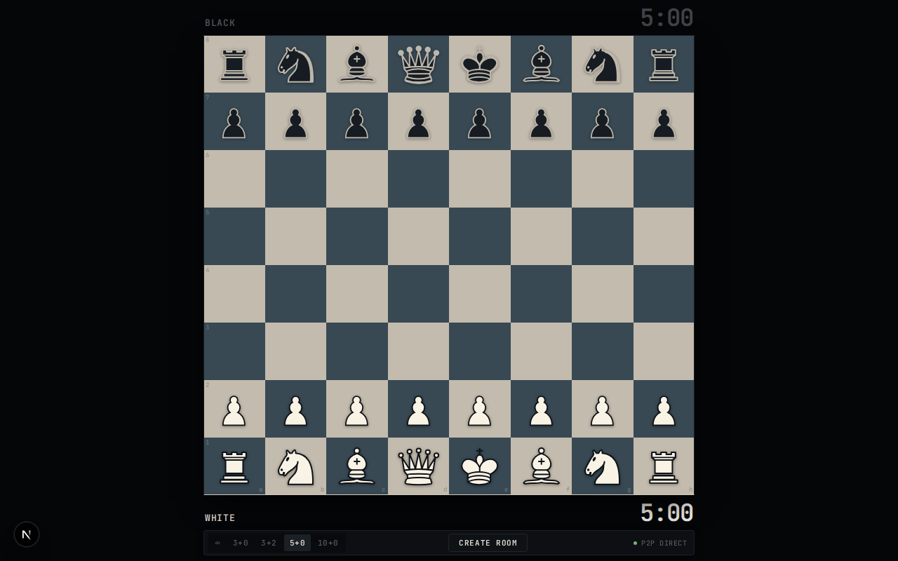
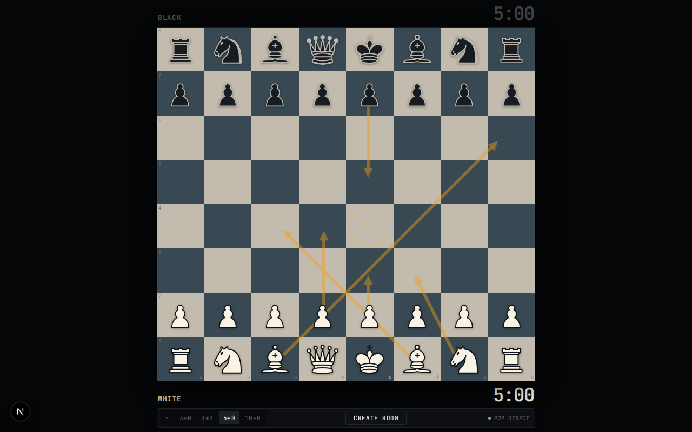
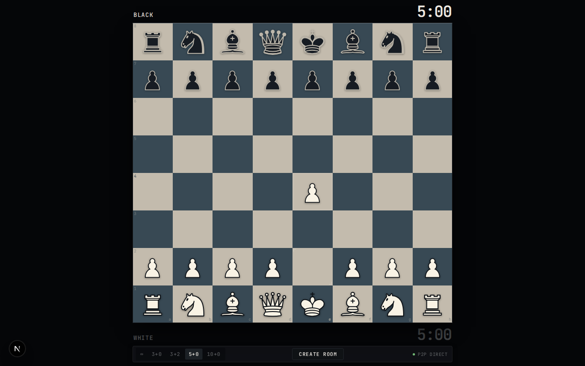

# VEYRN Chess

> **Precision Digital Chess Instrument**  
> A high-performance, free, and open chess platform built for players who value tactile feel, minimal design, and zero-latency peer-to-peer multiplayer.

---



---

## Overview

**VEYRN Chess** is a modern web-based chess instrument engineered from the ground up to eliminate platform friction, visual clutter, and network lag. Built around a manufactured mineral aesthetic and direct browser-to-browser networking, VEYRN offers an uncompromised playing experience accessible to everyone directly via a single shareable link — with zero accounts, zero trackers, and zero paywalls.

### Key Highlights

- **Free & Universal Access**: Instant games with no registration or paywalls required.
- **P2P WebRTC Multiplayer**: Moves transmitted directly between peers over encrypted WebRTC DataChannels for the lowest possible latency.
- **Obsidian Instrument Aesthetic**: High-contrast, mathematically calibrated OKLCH color palette (Warm Mineral & Deep Cool Slate) with a micro-3D milled board perimeter.
- **Right-Click Planning Layer**: Professional vector analysis arrows and square markers rendered on a non-occluding overlay layer.
- **Hardware-Composited Drag Pipeline**: 60/120 FPS piece manipulation powered by direct pointer capture, sub-pixel grab offset tracking, and zero React render overhead during drags.
- **Procedural Web Audio Engine**: Synthesized tactile stone-on-mineral clicks, deep sub-frequency capture impacts, and spatial stereo panning across board files.
- **Tabular Precision Clocks**: Monospace tabular numerals synchronized across peers with side-specific active indicators.

---

## Visual Previews

| Analysis & Planning Arrows | Active Game & Move Echo |
| :---: | :---: |
|  |  |

---

## Architecture & Technology Stack

```
VEYRN.ru/
├── src/
│   ├── app/
│   │   ├── api/
│   │   │   └── signal/[roomId]/route.ts  # Ephemeral Serverless WebRTC Signaling
│   │   ├── room/[id]/page.tsx            # P2P Guest Route
│   │   ├── globals.css                   # Obsidian Instrument Design Tokens & Geometry
│   │   ├── layout.tsx                    # Typography & Root Layout
│   │   └── page.tsx                      # Host & Sandbox Interface
│   ├── components/
│   │   ├── Chessboard.tsx                # Drag Pipeline, Planning Layer & Signal Rail
│   │   ├── Clock.tsx                     # Tabular Monospace Readout
│   │   ├── GameControls.tsx              # Compact Glass Control Strip
│   │   ├── GamePage.tsx                  # Engine & Transport Orchestrator
│   │   ├── Pieces.tsx                    # Custom Scalable Vector Piece Family
│   │   └── PromotionDialog.tsx           # Pawn Promotion Selector
│   ├── engine/
│   │   ├── GameEngine.ts                 # Chess Domain Coordinator (chess.js wrapper)
│   │   └── SoundEngine.ts                # Web Audio Procedural Synthesis
│   ├── transport/
│   │   └── GameTransport.ts              # WebRTC DataChannel & Dual Signaling Mesh
│   └── types/
│       ├── chess.ts                      # Domain Models & Time Controls
│       └── protocol.ts                   # Binary/JSON Wire Protocol Envelopes
├── scripts/
│   ├── test-engine.ts                    # 26 Domain & Game Logic Assertions
│   ├── test-signaling.ts                 # Serverless Signaling Integration Tests
│   └── test-two-clients.ts               # Multi-Client Playwright E2E Test
├── docs/
│   └── screenshots/                      # Architecture & UI Screenshots
└── package.json
```

### Core Technologies

- **Framework**: Next.js 16 (App Router, Turbopack, Serverless API Routes)
- **Language**: TypeScript 5 (Strict Mode)
- **Domain Engine**: `chess.js` 1.4.0 (Full FIDE Rule Compliance, PGN Generation, En Passant, Castling, 50-Move & Threefold Draw Detection)
- **Multiplayer Transport**: WebRTC DataChannels + Dual Signaling (BroadcastChannel for local tabs + Ephemeral Serverless HTTP polling for remote peers)
- **Acoustics**: Web Audio API (Synthesized BiquadFilters, stereo spatial panning, sub-bass oscillator transients)
- **Styling**: Vanilla CSS with CSS Custom Properties and OKLCH color space

---

## Launch Roadmap & Milestone

VEYRN is currently in closed pre-launch polish. 

- [x] **Phase 1**: Core Chess Engine & Domain Logic (26/26 Tests Passing)
- [x] **Phase 2**: Dual-Channel WebRTC P2P Transport & Session Recovery
- [x] **Phase 3**: Obsidian Instrument Design System & Hardware Drag Engine
- [x] **Phase 4**: Right-Click Planning Vector Layer & Raycast-Style Control Strip
- [ ] **Phase 5 (Public Launch)**: Launching publicly for the global community upon reaching 3,000 wishlist registrations on the upcoming landing portal.
- [ ] **Phase 6**: Engine Analysis integration (Stockfish 17 via WebAssembly) & opening book explorer.

---

## Getting Started

### Prerequisites

- Node.js 18.18+ or 20+
- npm, pnpm, or yarn

### Installation

```bash
# Clone the repository
git clone https://github.com/vansGAMee/veyrn_chess.git

# Enter project directory
cd veyrn_chess

# Install dependencies
npm install
```

### Development Server

```bash
npm run dev
```

Open [http://localhost:3000](http://localhost:3000) in your browser.

### Running Test Suites

```bash
# Run domain engine & logic tests (26 assertions)
npx tsx scripts/test-engine.ts

# Run WebRTC signaling endpoint tests
npx tsx scripts/test-signaling.ts

# Run full automated Playwright dual-client E2E test
npx tsx scripts/test-two-clients.ts
```

### Production Build

```bash
npm run build
npm start
```

---

## License

This project is licensed under the MIT License — free and open for the global chess community.
